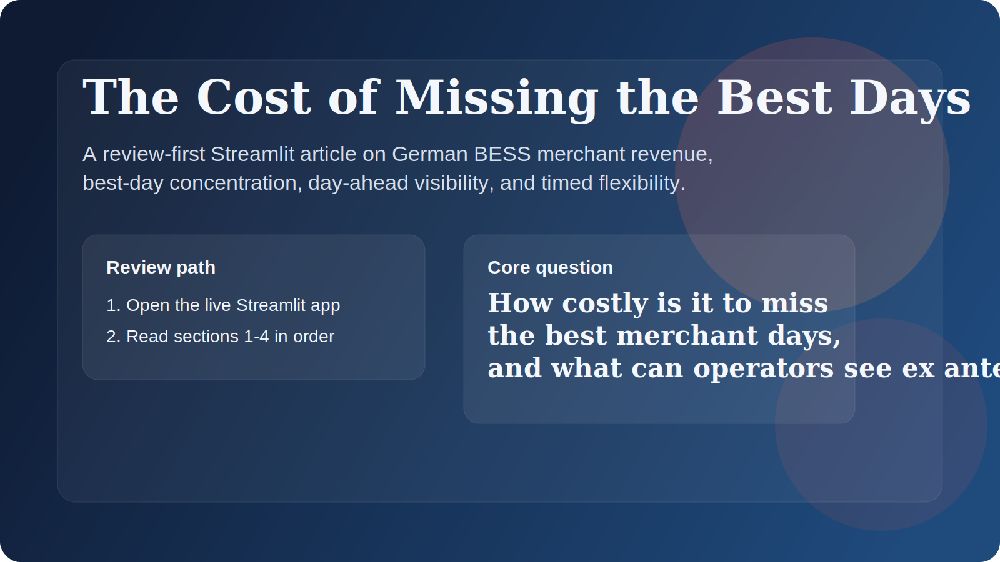

# The Cost of Missing the Best Days

[Open the live app](https://bess-best-days.streamlit.app)

[](https://bess-best-days.streamlit.app)



Publication-style Streamlit article on German BESS merchant revenue concentration, day-ahead visibility, and the value of timed availability, readiness, and flexibility.

## The Question
German BESS merchant revenue is not earned evenly through the year. A limited set of disproportionately valuable days drives annual outcomes, and many of those days are already partly visible before delivery. That changes the commercial question from average optimization to timed availability, readiness, and throughput allocation.

## Article Structure
- Section 1: revenue is concentrated where it matters most.
- Section 2: high-value days show a deeper midday trough and a wider evening-minus-midday ramp.
- Section 3: a useful early-warning screen exists at D-2, but the strongest screening power appears at D-1.
- Section 4: even with the same annual throughput, concentrating cycles into the strongest days earns more revenue.
- Closing: availability, readiness, and flexibility matter most when they are timed.

## What Is Implemented
- Day-ahead price ingestion from Energy-Charts with native timestep handling through the 2025 quarter-hour transition.
- Official intraday proxy ingestion from Netztransparenz `ID-AEP`.
- Sequential day-ahead plus intraday-overlay dispatch using SciPy HiGHS.
- A publication-style Streamlit narrative built around four fixed sections and a closing owner takeaway.
- Revenue concentration analytics, best-day shape diagnostics, pooled watchlist screening, and same-throughput reallocation analysis.

## Core Method
- Scope: base case is a 2h battery with a 2025 deep dive; validation uses pooled `2021-2025` data.
- Merchant revenue is modeled as one combined day-ahead plus intraday series using Energy-Charts day-ahead prices and the official Netztransparenz `ID-AEP` index for the intraday layer.
- Dispatch is modeled sequentially across day-ahead and intraday with fixed round-trip efficiency of `0.86`.
- Best-day shape compares top-20 revenue days against the full sample average day using median hourly day-ahead price profiles.
- Watchlist screening uses pooled `2021-2025` precision, recall, and lift versus the top-20 revenue-day base rate.
- Same-throughput reallocation compares strict daily caps with an annual allocator using the same realized FEC, isolating timing value from extra throughput.

## Important Modeling Choices
- Dispatch is a perfect-foresight upper bound.
- `ID-AEP` is used as an audit-friendly intraday proxy, not as a full continuous intraday trade tape.
- The merchant stack is modeled as sequential `DA + intraday overlay`, not as a fully joint `DA+ID` co-optimization.
- The app fixes round-trip efficiency at `0.86` and does not expose it as a user control.
- Reallocation uplift is still based on realized opportunity ranking, so it should be read as an economic upper bound on timing value.
- No `FCR`, `aFRR` energy, or ancillary co-optimization stack is modeled.

## How To Run
```bash
python -m venv .venv
source .venv/bin/activate
pip install -r requirements.txt
streamlit run app.py
```

## Project Structure
```text
bess-best-days/
├── README.md
├── requirements.txt
├── app.py
├── assets/
│   └── review-hero.svg
├── src/
│   ├── analysis/
│   ├── charts/
│   ├── data/
│   └── models/
├── data/
│   └── cache/
```

## Assumptions And Limitations
- The article is intentionally fixed-scope and publication-style, not an exploratory dashboard.
- D-2 metrics in Section 3 are presented as an early-warning benchmark used in the article narrative.
- The app uses public market data and simplified merchant dispatch assumptions to make the owner problem legible, not to replicate plant-level execution frictions exactly.
- Degradation excludes temperature, C-rate effects, and chemistry-specific nonlinearities.
